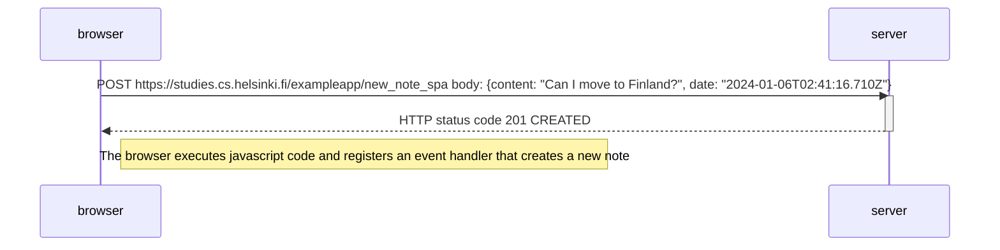

```mermaid
sequenceDiagram
    participant browser
    participant server

    browser->>server: POST https://studies.cs.helsinki.fi/exampleapp/new_note_spa body: {content: "Can I move to Finland?", date: "2024-01-06T02:41:16.710Z"}
    activate server
    server-->>browser: HTTP status code 201 CREATED
    deactivate server

    Note right of browser: The browser executes javascript code and registers an event handler that creates a new note
```
